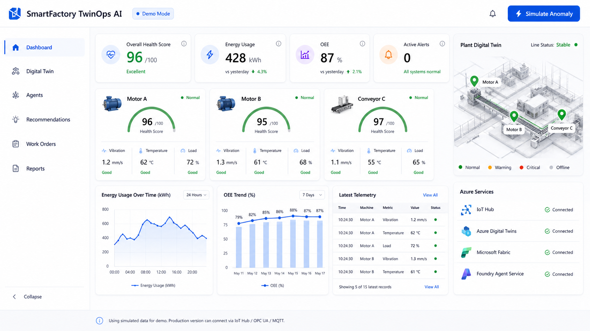
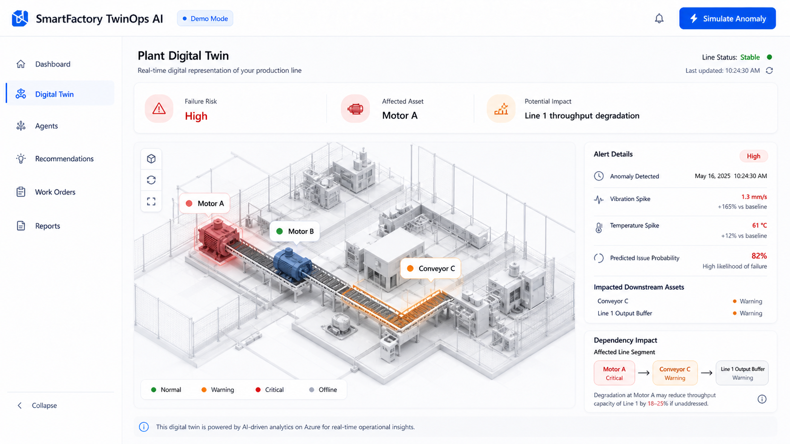
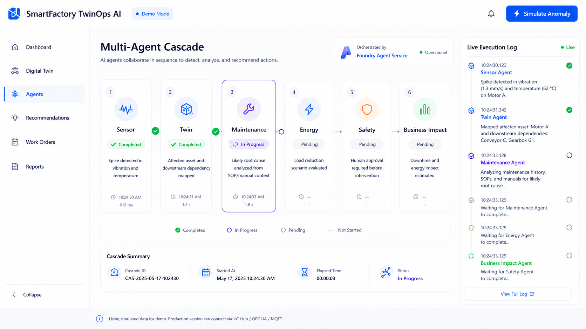
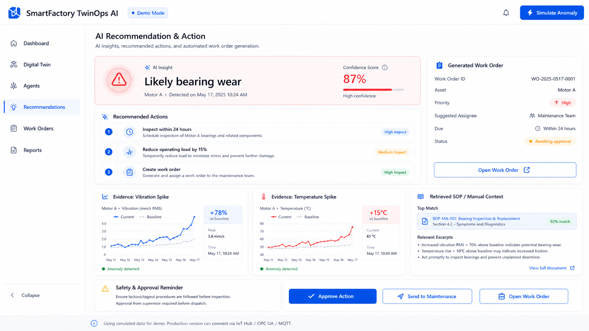

# SmartFactory TwinOps AI

SmartFactory TwinOps AI is a hackathon-ready factory operations demo that shows how a production line can move from raw telemetry and alerts to a digital twin, AI-assisted root-cause analysis, recommended actions, and maintenance execution.

Live demo: https://smart-factory-alpha.vercel.app

## Demo Screens









## What The Demo Shows

The app presents **Packaging Line 1** as a Microsoft/Azure-style operations console for a 2-minute pitch. It is frontend-only, uses mocked/simulated operational data, and is designed to make the end-to-end value clear without requiring real factory connectivity.

Core story:

1. Monitor production-line health, OEE, energy usage, alerts, and latest telemetry.
2. Visualize asset relationships in a plant digital twin.
3. Simulate an anomaly on Motor A.
4. Show a multi-agent cascade that detects the issue, maps asset impact, checks maintenance context, and prepares an action.
5. Present an AI recommendation with evidence and supervisor approval.
6. Generate and dispatch a maintenance work order.
7. Explain business value, Azure architecture, ROI assumptions, and rollout roadmap.

## Main Pages

- **Dashboard**: executive KPIs, asset health cards, energy/OEE charts, latest telemetry, Azure service status, and digital twin preview.
- **Digital Twin**: plant map, dependency impact, alert details, and status legend.
- **Agents**: multi-agent cascade with Sensor, Twin, Maintenance, Energy, Safety, and Business Impact agents plus a live execution log.
- **Recommendations**: AI insight, confidence score, recommended actions, evidence charts, SOP guidance, approval, and maintenance dispatch.
- **Work Orders**: maintenance queue, work order details, checklist, status, assignee, due date, and action history.
- **Reports**: value metrics, cost avoidance model, pain-point mapping, Azure architecture, operating model, paradigm shift, and roadmap.

## Demo Controls

- **Simulate Anomaly** starts the Motor A issue scenario and opens the Agents page.
- **Reset** returns the demo to a stable monitoring state.
- **Approve Action** changes the generated work order state to approved.
- **Send to Maintenance / Dispatch** moves the work order to dispatched.
- Sidebar controls support desktop collapse/hide and mobile navigation.
- Notifications provide shortcuts into alerts and report context.

## Scenario

The current demo focuses on a factory line with three assets:

- **Motor A**: primary issue source during the anomaly scenario.
- **Motor B**: stable connected machine in the production line.
- **Conveyor C**: downstream machine that can become impacted when Motor A is critical.

When the anomaly is active, Motor A health drops, alert severity rises, agent execution begins, recommendations become high-confidence, and the work order flow becomes the center of the pitch.

## Microsoft/Azure Architecture Story

The Reports page frames the production architecture as:

```text
Factory Edge
-> IoT Hub
-> Fabric Real-Time
-> Azure Digital Twins
-> Azure ML
-> Foundry Agents
-> Tools & Work Orders
```

The demo also highlights Azure service roles:

- **IoT Hub** for telemetry ingress from PLC, OPC UA, and MQTT sources.
- **Azure Digital Twins** for asset graph and dependency context.
- **Microsoft Fabric** for operational history and reporting.
- **Foundry Agent Service** for agent orchestration and action generation.

## Tech Stack

- React
- TypeScript
- Tailwind CSS
- Recharts
- Lucide React
- Vite

No backend or external API is required for this MVP.

## Run Locally

```bash
npm install
npm run dev
```

Then open:

```text
http://localhost:5173
```

## Build

```bash
npm run build
```

## Preview Production Build

```bash
npm run preview
```

## Deployment

The project is deployed on Vercel:

```text
https://smart-factory-alpha.vercel.app
```

For a new deployment:

```bash
npx vercel deploy --prod
```

## Hackathon Notes

This is a frontend-first MVP. In a production version, telemetry would come from factory systems such as PLCs, IoT gateways, OPC UA, MQTT, or Azure IoT Hub. The summarized machine context can later be sent to GPT-4o or another AI reasoning layer, while a backend API can persist telemetry, digital twin state, recommendations, and maintenance work orders.
